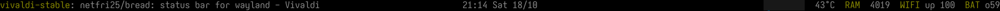

# Bread
simple, easily composable, non-interactlable, controlled from stdin, wayland status bar.

"a bar that reads" (b read).



### Specifications
 - non-interactable (by design)
 - controlled from stdin with simple but powerful attributes
 - single threaded (by design)
 - efficient polling system
 - works on multiple monitors (and doesn't crash when monitor disconnects)
 - for [wlroots compositors](https://github.com/solarkraft/awesome-wlroots?tab=readme-ov-file#compositors)

### Build Dependencies
 - [Rust](https://rust-lang.org)
> [!NOTE]
> doesn't need wayland development packages

### Getting started

#### Installation
if you don't have Rust on your system, [install it](https://rustup.rs)
```shell
cargo install --git https://github.com/netfri25/bread
```

#### Usage
```shell
my-script | bread --font "Iosevka-Custom"
```
where `my-script` is your own script, that generates content for `bread` to display

if you don't feel like creating your own script, consider using [bread-content](https://github.com/netfri25/bread-content)

### Customization
`bread` only renders information given in stdin. this means that you need to create your own program/script that can gather the information that you want to render and generate the output to be parsed by `bread`

a reference program can be found [here](https://github.com/netfri25/bread-content), which is the program that I use in my own setup.

`bread` is able to parse the following attributes:
```
%{l} - left section
%{c} - center section
%{r} - right section

%{F:[AA]RRGGBB} - foreground color
%{B:[AA]RRGGBB} - background color

%{R:WxH} - ramp (width x height in pixels)
```
everything else is parsed as plain text.

`bread` keeps track of the last speficied attributes, which means you don't have to specify the section/color before each text content or a ramp.

### Why?
I want to:
 - learn wayland
 - create my own status bar
 - separate rendering from information gathering
 - have flexible design
 - be the same on all monitors
 - be single threaded with efficient polling

the bar that made me almost satisfied is [zelbar](https://sr.ht/~novakane/zelbar/), and it encouraged me to create my own.
the only things I had issues with while trying out zelbar is that I wasn't able to draw boxes with a defined width and height (which I like for cpu usage), and it crashed if I closed the monitor it was on (which I do from time to time, because I use a laptop).

### TODO
 - [x] multi monitor rendering
    - [x] test with another monitor
 - [x] input parsing
 - [x] rendering
 - [x] async polling
 - [x] mention the other project that is able to provide content, as an example
 - [ ] cli arguments for simple config
    - [x] default fg/bg colors
    - [x] height
    - [ ] position (top/bottom)
    - [x] font
    - [x] font size
    - [ ] specific monitor (or all monitors by default)
 - [ ] write a manpage

### Special Thanks
[zelbar](https://sr.ht/~novakane/zelbar/), which inspired this project.

[wayland-rs](https://github.com/Smithay/wayland-rs), which provides a really comfortable design for working with wayland.

[wayland](https://wayland.freedesktop.org) for providing an amazing protocol and architecture!
